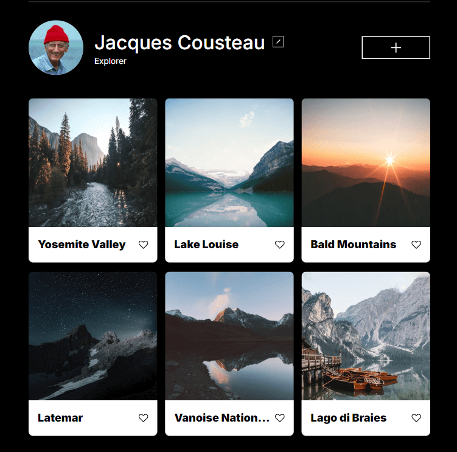
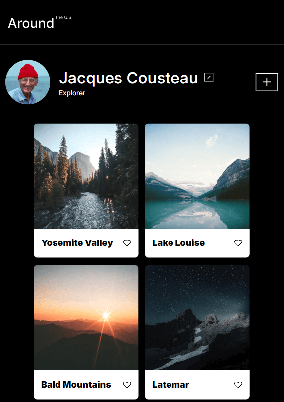
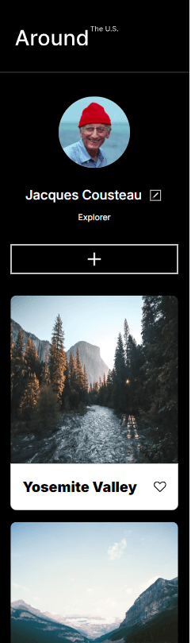

# Project 3: Around The U.S.

Based on a Figma UI, created a responsive layout that closely represents the design with the addition of buttons and hover features using HTML and CSS. Understanding how to navigate through Figma help create the responsive design. The usage of flexbox, grids, and media queries were required to make the design responsive to the screen size changes.

## Different Viewport Images

## Project Link

![Project] https://seankpham.github.io/se_project_aroundtheus/

## Project Video

Volume Warning!! There is a lot of background noise that I couldn't figure out where it was coming from. Please turn down the volume before watching

https://drive.google.com/file/d/1dB41uBQsYghRkmd2zcasm30OHRUOcqNr/view?usp=sharing
